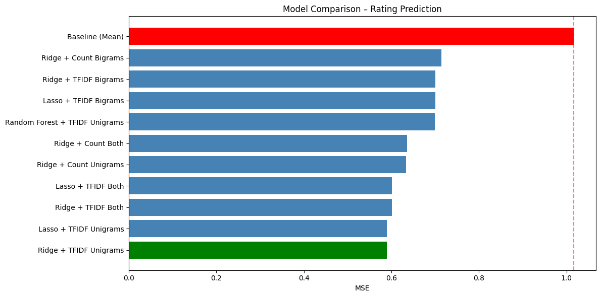
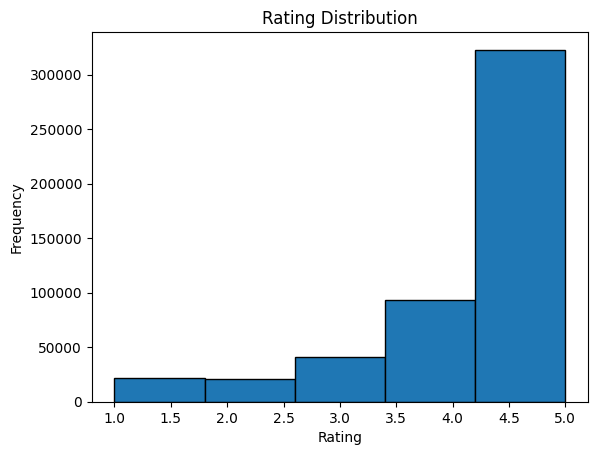

# Amazon Review Rating Prediction

Predict Amazon book review star ratings (1–5) from review text using hand-implemented TF-IDF features and classical regressors.

This repo is a cleaned packaging of the CSE 158 Assignment 2 workbook (`Assignment2.ipynb` / `workbook.html`). Notebook section order matches the HTML report.

## Data

McAuley Amazon Review Data (Books subset), **500K** reviews. Do **not** commit the dataset. Download [Books.json.gz](https://cseweb.ucsd.edu/~jmcauley/datasets/amazon_v2/) and place it at:

```text
dataset/Books.json.gz
```

Or set `AMAZON_BOOKS_PATH` to a local copy (e.g. `Books_500k.json`).

## Method

Handwritten **TF / DF / TF-IDF** (binary TF + IDF) over top-1000 unigrams/bigrams, then compare **Ridge**, **Lasso**, and **Random Forest**. Evaluation: MSE on a fixed 80/20 split (400k / 100k).

Core feature code (your Assignment2 implementations) lives in [`src/features.py`](src/features.py).

## Results

Best model: **Ridge + TF-IDF Unigrams**, MSE **0.590** (~42% better than the mean baseline of 1.017).

| Model | MSE | vs Baseline |
| --- | ---: | ---: |
| Baseline (Mean) | 1.017 | 0% |
| Ridge + Count Unigrams | 0.633 | 37.7% |
| Ridge + TFIDF Unigrams | **0.590** | **42.0%** |
| Lasso + TFIDF Unigrams | 0.590 | 42.0% |
| Random Forest + TFIDF Unigrams | 0.699 | 31.2% |





## Reproduction

```bash
python -m venv .venv
source .venv/bin/activate
pip install -r requirements.txt

# put Books.json.gz under dataset/
jupyter notebook notebooks/rating_prediction.ipynb
```

Readable HTML version of the same report: [`notebooks/workbook.html`](notebooks/workbook.html).

## What’s where (from your original files)

| Source file | Used for |
| --- | --- |
| `Assignment2.ipynb` | Main notebook structure, code, outputs, write-ups |
| `workbook.html` | Same report as rendered HTML (kept under `notebooks/`) |
| `EDA.ipynb` / EDA cells in Assignment2 | Section 1 Exploratory analysis |
| `feat_engr.ipynb` | Feature write-ups; final TF/DF/TF-IDF code from Assignment2 |
| `book_review.ipynb` | Earlier drafts of fit helpers / modeling loops |
| `amazon.ipynb` / `Amazon Review.ipynb` | Early prototypes (not needed to re-run the final report) |

CSE 158 course project.
